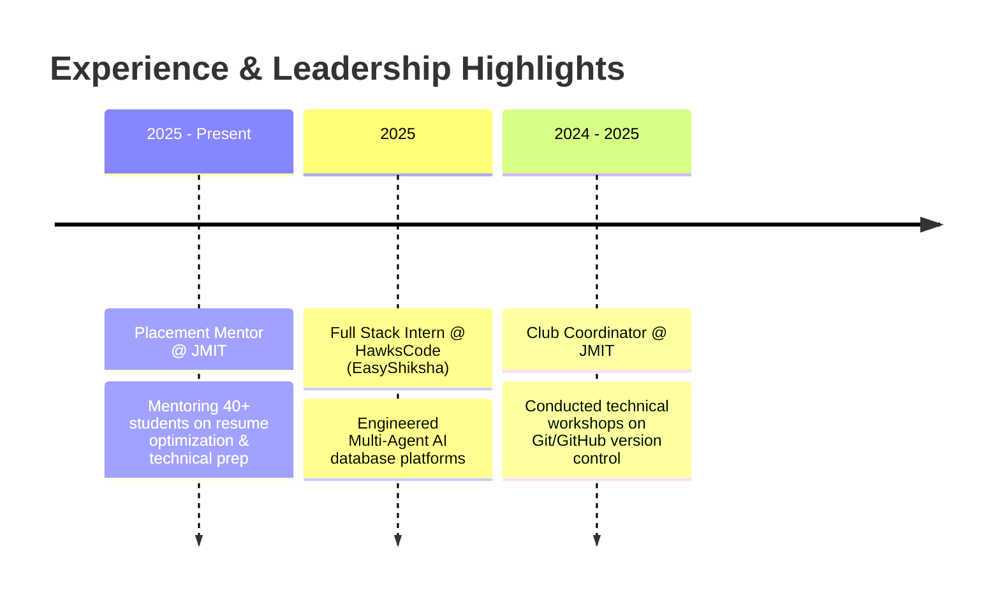

<div align="center">

  <!-- Animated Header Banner -->
  

  <br/>

  <!-- Dynamic Typing SVG Banner -->
  <a href="https://github.com/VibhuSuneja">
    
  </a>

  <br/><br/>

  <!-- Quick Social Connect Badges -->
  <a href="https://www.linkedin.com/in/vibhusuneja08">
    
  </a>
  &nbsp;
  <a href="https://github.com/VibhuSuneja">
    
  </a>
  &nbsp;
  <a href="mailto:vibhusun01@gmail.com">
    
  </a>

  <br/><br/>

  <!-- Profile Visitor Counter -->
  

</div>

<hr/>

### 💫 About Me

```yaml
Developer Profile:
  Name: Vibhu Suneja
  Education: B.Tech Computer Science Undergraduate @ JMIT
  Primary Focus: Full-Stack MERN Development & Multi-Agent AI Workflows
  Current Goal: Building scalable AI-integrated web applications & backend systems
  Interests: Autonomous AI Agents, Distributed Systems, Web Performance & Security
```

- 🔭 Currently engineering **Multi-Agent AI platforms** and high-performance **MERN applications**.
- 💼 Recently completed a **Full Stack Internship @ HawksCode (EasyShiksha)** focusing on AI backend integration.
- 🎓 Serving as a **Placement Mentor & Club Coordinator @ JMIT**, mentoring 40+ students in resumes & Git workflows.
- 💬 Ask me about **React, Next.js, Node.js, Express, MongoDB, and Agentic AI Architecture**.
- ⚡ Fun fact: Driven by clean code, legal/business technology awareness, and seamless user experiences!

---

### 🏆 Achievements & Profile Highlights

<div align="center">

  <a href="https://github.com/VibhuSuneja">
    
  </a>
  &nbsp;
  <a href="https://github.com/VibhuSuneja">
    
  </a>
  &nbsp;
  <a href="https://github.com/VibhuSuneja">
    
  </a>

  <br/><br/>

  <!-- Profile Summary Card -->
  

</div>

---

### 🛠️ Technical Arsenal

<div align="center">

| Category | Technologies & Tools |
| :--- | :--- |
| **Languages** |      |
| **Frontend** |      |
| **Backend & DB** |     |
| **AI & Specialization** |   |
| **Tools & Platforms** |     |

</div>

---

### 💻 Featured Projects

<table width="100%">
  <tr>
    <td width="50%" valign="top">
      <h3 align="center">🤖 AI Learning Ecosystem</h3>
      <p align="center">
        <a href="https://github.com/VibhuSuneja/LearningManagement_system-">
          
        </a>
      </p>
      <ul>
        <li><b>Tech Stack:</b> MongoDB, Express, React, Node.js, AI Models</li>
        <li><b>Key Feature:</b> Enterprise-ready learning platform featuring course management & AI-assisted content discovery.</li>
        <li><b>Impact:</b> Serving 40+ active users with intelligent learning workflows.</li>
      </ul>
    </td>
    <td width="50%" valign="top">
      <h3 align="center">🌾 AgrowCart</h3>
      <p align="center">
        <a href="https://github.com/VibhuSuneja/Agrowcart">
          
        </a>
      </p>
      <ul>
        <li><b>Tech Stack:</b> Next.js, React, Tailwind CSS, Node.js</li>
        <li><b>Key Feature:</b> Hyperlocal e-commerce marketplace connecting local farmers directly with consumers.</li>
        <li><b>Impact:</b> Direct farm-to-table trade streamlining local commerce.</li>
      </ul>
    </td>
  </tr>
  <tr>
    <td width="50%" valign="top">
      <h3 align="center">📊 Devlok</h3>
      <p align="center">
        <a href="https://github.com/VibhuSuneja/devlok">
          
        </a>
      </p>
      <ul>
        <li><b>Tech Stack:</b> React, D3.js, Data Visualization</li>
        <li><b>Key Feature:</b> Interactive data visualization platform explaining historical events and relationships.</li>
        <li><b>Impact:</b> Educated 50+ youth with dynamic graphical insights.</li>
      </ul>
    </td>
    <td width="50%" valign="top">
      <h3 align="center">⚡ Multi-Agent AI Platform</h3>
      <p align="center">
        
      </p>
      <ul>
        <li><b>Tech Stack:</b> MERN, AI Agents, Database Automation</li>
        <li><b>Key Feature:</b> Autonomous agent workflows engineered during internship at HawksCode (EasyShiksha).</li>
        <li><b>Impact:</b> Automated complex database-driven operations.</li>
      </ul>
    </td>
  </tr>
</table>

---

### 💼 Experience & Leadership



---

### 📊 GitHub Activity & Metrics

<div align="center">

  
  &nbsp;
  

  <br/><br/>

  
  &nbsp;
  

  <br/><br/>

  

</div>

---

### 🐍 Contribution Snake Animation

<div align="center">
  <picture>
    <source media="(prefers-color-scheme: dark)" srcset="https://raw.githubusercontent.com/VibhuSuneja/VibhuSuneja/output/github-contribution-grid-snake-dark.svg">
    <source media="(prefers-color-scheme: light)" srcset="https://raw.githubusercontent.com/VibhuSuneja/VibhuSuneja/output/github-contribution-grid-snake.svg">
    
  </picture>
</div>

---

<div align="center">

  <!-- Footer Banner -->
  

  <br/>
  
  <i>"Building intelligence into code, piece by piece."</i> 🚀
  
  <br/><br/>
  
  📫 **Let's Connect:** [LinkedIn](https://www.linkedin.com/in/vibhusuneja08) • [Email](mailto:vibhusun01@gmail.com) • [GitHub](https://github.com/VibhuSuneja)

</div>
